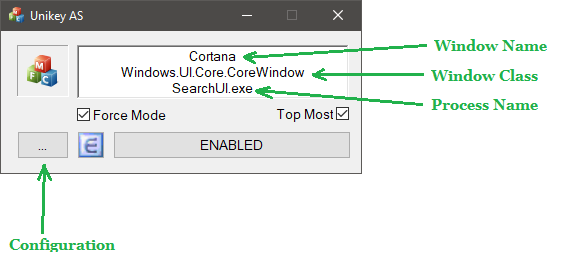
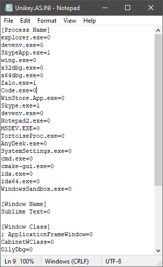

### Unikey AS ###

Unikey AS - The auto switching mode English/Vietnamese for [Unikey NT (4.2 RC4 Build 140823 64-bit)](Unikey.NT-4.2.RC4.zip)

Tool này có chức năng rất đơn giản là tự động chuyển kiểu gõ EN/VN cho riêng mỗi app lúc focusing dựa vào quy định theo `process name`, `class name`, `title name` trong file cài đặt `Unikey.AS.INI`, rất tiện và không còn bực mình vì kiểu gõ trong khi làm việc coding, chatting, etc.

#### INSTALLATION

> 1. Tải phiên bản [Unikey NT 4.2 RC4](https://github.com/vic4key/Unikey-AS/blob/master/Unikey.NT-4.2.RC4.zip) về giải nén và chạy (chưa test với các phiên bản khác).

> 2. Tải tool [Unikey AS](https://github.com/vic4key/Unikey-AS/releases) về giải nén và chạy.

> 3. Thêm/Xóa app vào file cài đặt bằng nút ... Để biết được `process name`, `class name`, `title name` thì focus vào app muốn set, sử dụng một trong ba tham số này, và set giá trị `0 (EN)`, `1 (VI)`. Ví dụ: Muốn set process `Visual Studio` luôn sử dụng tiếng anh thì `devenv.exe=0`.

> 4. Ngoài ra
>> - Force Mode : Nếu tích chọn thì người dùng không thể chuyển kiểu gõ khác. Nếu bỏ tích chọn thì người dùng có thể linh động chuyển kiểu gõ lúc đang focus nhưng lần sau focus lại app thì tool vẫn sẽ tự động chuyển kiểu gõ theo cài đặt.
>> - Top Most : Hiển thị GUI tool trên các app khác.

#### SCREENSHOTS

_ _ _

Website: https://vic.onl/